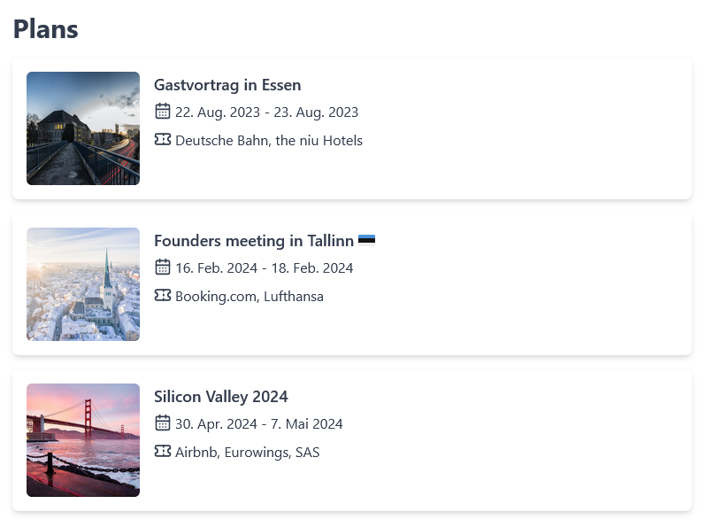

# TravelTrack

Manage all your itineraries in a single, clean interface. Keep all your receipts and tickets in one place.

## Plans

This project will eventually become an open source replacement for tools like TripIt, Tripcase and Kayak Trips. Travel data is quite sensitive and shouldn't have to be shared with and analysed by companies.

I also plan to implement features that are currently missing from existing tools, and I want to focus specifically on these aspects:

### Manual editing capabilities

Current tools rely heavily on forwarding email booking confirmations, which are then automatically parsed. This process is somewhat fragile and will break if the layout of such messages changes or an unexpected value appears somewhere. It also won't work if bookings are made via channels that don't result in an email confirmation. For these cases, I want to make it as easy as possible to manually edit schedules and remove arbritrary restrictions imposed by existing tools.

### Eco-friendly travel

The tools I have tested so far struggle with bus and train connections. Even where they can theoretically be added, it is usually cumbersome and awkward to add, retrieve and edit such information, as most of the existing logic is focused on air travel. I plan to make environmentally friendly alternatives first class entities, with station locations and connection information properly displayed.

## Status

Although this is a project I've wanted to start for a long time, I don't have much time for it at the moment, as I have a rather demanding job that leaves me with little energy to work on TravelTrack.

This is not a useful project at the moment. All it provides is the ability to view itineraries:



Data within each itinerary (such as bookings, segments of each booking) can also be viewed, but TravelTrack uses a simple debug view to display this.

**tl;dr** Do not use this right now (but feel free to bookmark the project and contact info@traveltrack.dev if you have any questions).

## Requirements

### PostgreSQL

TravelTrack requires a PostgreSQL database to function. I am developing TravelTrack on version 15, though older (and newer) versions should work fine as well. For testing purposes, spin up a PostgreSQL database using the following command:

```bash
docker run -it --rm --name traveltrack-postgres -e POSTGRES_USER=traveltrack -e POSTGRES_PASSWORD=traveltrack -p 5432:5432 -v ~/traveltrack-postgres:/var/lib/postgresql/data postgres:15
```

### Node.js

As an Express.js application, TravelTrack requires [Node.js](https://nodejs.org/) to function. It is being built using Node.js 18 (the current LTS version), though many older (and newer) versions should work as well. You can find installation instructions on the Node.js website.

### Dependencies

TravelTrack comes with a few common dependencies, like the hbs view engine, Tailwind CSS + daisyUI and node-postgres. To install them, run `npm install`.

### Configuration

Set the following environment variables (or create a .env file) with the following values:

* `DB_HOST`: PostgreSQL host, defaults to `localhost`
* `DB_PORT`: PostgreSQL port, defaults to `5432`
* `DB_NAME`: Database name, defaults to `traveltrack`
* `DB_USER`: Database user, defaults to `traveltrack`
* `DB_PASSWORD`: Database password, defaults to `traveltrack`
* `PORT`: Port the web app listens on, defaults to `3000`
* `PUBLIC_URL`: Base URL of the web app, defaults to `http://localhost:PORT`
* `SECRET`: Secret to sign and verify cookies, defaults to `secret`
* `SESSION_LENGTH`: Session duration in minutes, defaults to `1440`

## Start the project

1. Clone the GitHub repository
2. Enter the newly created directory
3. Install dependencies
4. Start the app

```bash
git clone git@github.com:traveltrack-dev/traveltrack.git
cd traveltrack
npm install
npm start
```